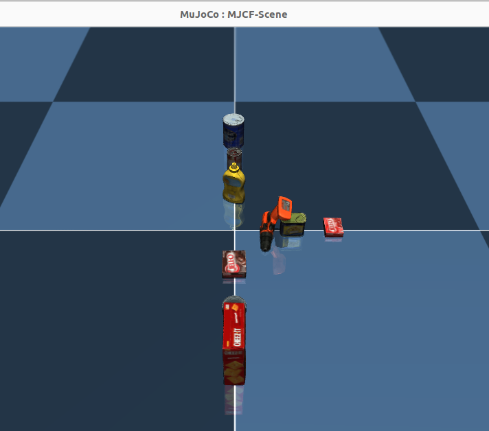

# MJCF-Component
MJCF-Component is a mechanism that allows you to add objects to an MJCF model freely.
## Features
#### ·supports 70+ YCB objects in mujoco.You can check out supported ycb objects in 
## How to use？
```
git clone https://github.com/AvalonGuo/MJCF-Component.git
cd MJCF-Component
python3 -m mjcomponent/demo/attach_ycb.py
```
## Ycb objects supported

